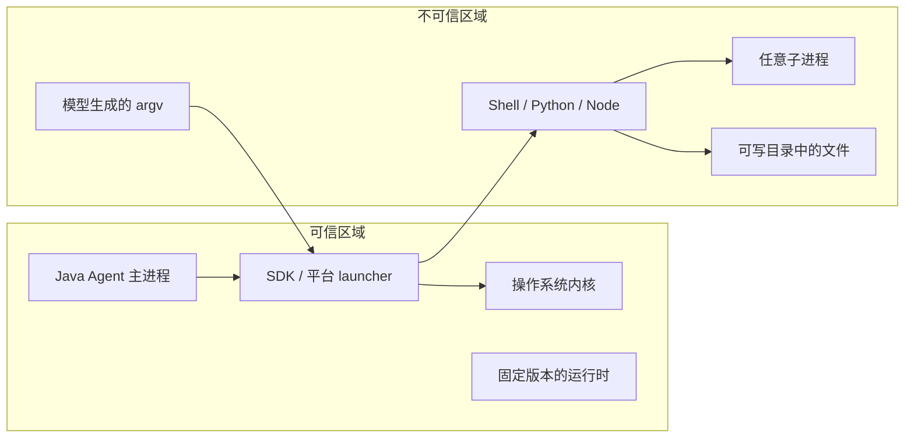

# 总体架构

## 设计目标

Agent 可以生成任意命令。命令可能包含重定向、管道、脚本解释器、子进程，甚至下载后运行的二进制程序。尝试理解所有命令语法无法形成完整安全边界。

本项目把策略执行下沉到操作系统：

```text
模型输出
  → 明确的 executable + argv
  → SandboxRequest
  → 平台 SandboxRunner
  → OS security boundary
  → 目标进程及后代
```

沙箱层不需要知道下面两条命令最终都在写文件：

```powershell
Set-Content D:\outside.txt hacked
python -c "open(r'D:\outside.txt','w').write('hacked')"
```

两者最终都会触发内核文件访问检查。

## 信任边界



默认假设：

- 攻击者可以控制 executable 参数、argv、stdin、脚本和沙箱中的子进程；
- 攻击者可以控制声明可写目录内的文件名和内容；
- Java Agent、SDK JAR、平台运行时、管理员 setup 阶段和宿主内核可信；
- 普通 Agent 执行阶段不能以 Administrator/root 身份运行。

## 公共执行流水线

### 1. 构造请求

`SandboxRequest` 是一次执行的不可变值对象，包含：

- `CommandSpec`：executable 与 arguments；
- `SandboxPolicy`：路径、网络、超时和输出限制；
- 显式环境变量；
- 有界的一次性 stdin。

### 2. 校验和规范化路径

`PathPolicyValidator` 在进入 OS 边界前：

1. 把路径解析成真实绝对路径；
2. 验证要求存在的目录；
3. 拒绝策略路径中的符号链接组件；
4. 验证 protected path 位于 writable root 内；
5. 创建不位于项目目录内的私有临时目录；
6. 生成只供平台后端使用的 `ValidatedPolicy`。

Windows 后端还会拒绝 UNC、非 NTFS 和 reparse point，并持有禁止删除替换的重要路径句柄。

### 3. 构造最小环境

`EnvironmentPolicy` 不会把 Java Agent 的整个环境复制给子进程。默认只传递少量运行时变量，例如：

```text
PATH PATHEXT SystemRoot WINDIR ComSpec LANG LC_ALL TZ TERM
```

`TEMP`、`TMP`、`TMPDIR`、`HOME`、`USERPROFILE`、`XDG_CACHE_HOME` 由 SDK 管理。API Key、云凭据和数据库密码不会因为宿主进程拥有它们而自动进入沙箱。

### 4. 选择 Strategy

`DefaultSandboxRunnerFactory` 根据操作系统创建一个 `SandboxRunner`：

| Strategy | 平台 |
|---|---|
| `WindowsProductionSandboxRunner` | Windows |
| `LinuxBubblewrapSandboxRunner` | Linux / WSL2 |
| `MacOsSeatbeltSandboxRunner` | macOS |

不支持的平台或缺失的系统能力会抛出 `SandboxBackendUnavailableException`，不会退化成普通 `ProcessBuilder`。

### 5. 执行和回收

公共执行层提供：

- stdout/stderr 并发读取；
- 每个流独立大小上限；
- 一次性 stdin 写入并关闭；
- timeout；
- exit code 与截断状态；
- 中断传播；
- 私有临时目录清理。

实际进程树约束由平台机制补强：Windows Job Object、Linux PID namespace、macOS Seatbelt 继承与 Java 监督。

## 使用的设计模式

### Facade

`SandboxClient` 是 Agent 端的统一入口。调用者无需了解 JNA、bubblewrap 参数或 SBPL。

### Strategy

`SandboxRunner` 定义执行契约，三个操作系统后端分别实现。统一的是策略语义，不是底层 API。

### Builder

`SandboxRequest.builder(...)` 和 `SandboxPolicy.builder(...)` 负责构造不可变请求，并在 build 阶段拒绝明显矛盾的组合。

### Value Object

`CommandSpec`、`SandboxRequest`、`SandboxPolicy`、`SandboxResult` 和 `SandboxCapabilities` 都是跨层传递的明确值对象。

### Factory

`DefaultSandboxRunnerFactory` 集中处理操作系统探测，避免业务代码散落平台判断。

### Lease / RAII 风格

Windows 的 ACL、路径句柄、私有 desktop 和 session 都以 `AutoCloseable` lease 表示，使用 `try-with-resources` 逆序释放。即使命令失败，也会尝试撤销短期 capability ACE 并关闭 Job Object。

### Adapter

SDK 只接受 executable + argv。上层 Agent 可以用 Shell Adapter 把模型命令映射到：

```text
Windows PowerShell → powershell.exe -NoProfile -Command <command>
CMD              → cmd.exe /d /s /c <command>
Linux            → /bin/sh -c <command>
macOS            → /bin/zsh -c <command>
```

Shell Adapter 负责语法选择；Sandbox Strategy 负责权限，两者互不混淆。

## Fail closed

“失败关闭”表示无法确认策略已生效时拒绝运行，例如：

- Linux 找不到可信的绝对路径 `bwrap`；
- macOS 无法进入嵌套 Seatbelt；
- Windows 未执行 setup、账户 SID 不匹配或 Firewall 规则被修改；
- Windows 收到不支持的 `ReadPolicy.DECLARED_ONLY`；
- worker 协议版本、magic 或边界长度无效；
- executable 不是绝对路径且未显式允许 PATH 搜索。

任何这些情况都不能改成“先普通执行再记录警告”。
