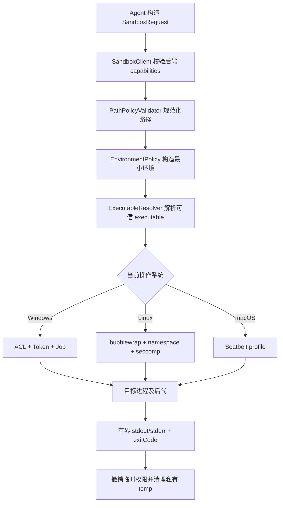
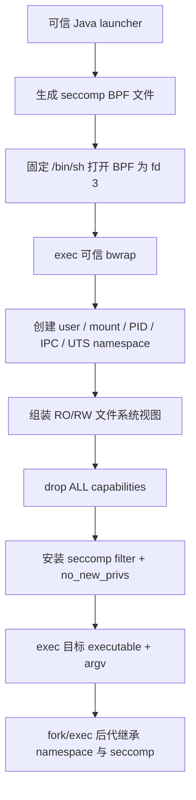
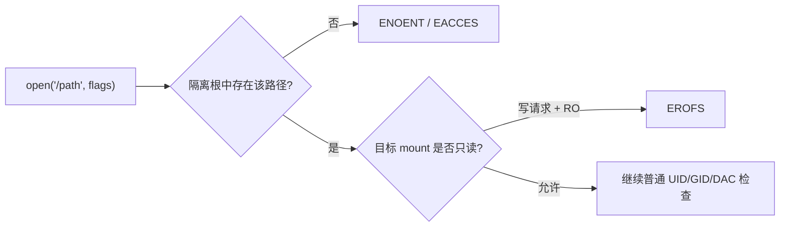
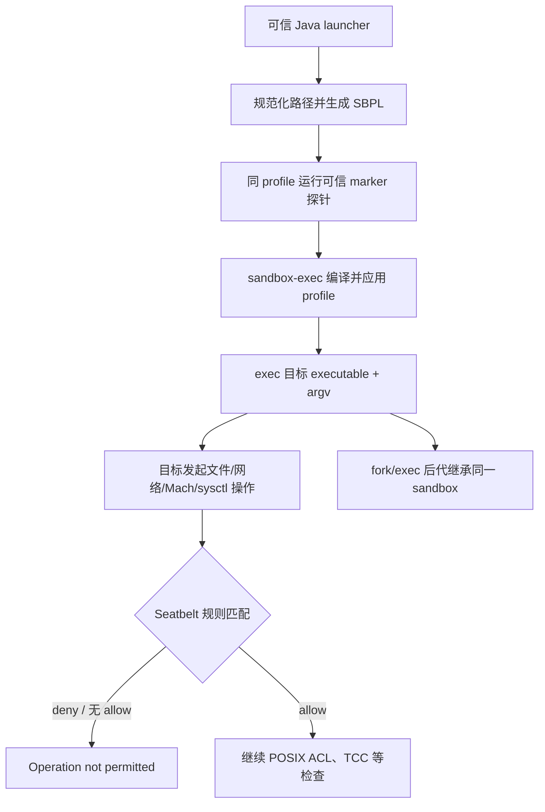

# 实现原理与权限控制粒度

本文从当前仓库代码出发，说明一次 `SandboxRequest` 如何被翻译成 Windows、Linux 和
macOS 的操作系统策略，以及这些策略实际能控制到什么粒度。它描述的是**当前实现**，
不是理想化设计；代码已声明但仍存在验证缺口的能力会单独标出。

## 结论先行

这个 SDK 的核心不是识别 `rm`、`Remove-Item`、Python `open()` 等命令，而是让目标进程
及其后代进入操作系统强制的安全边界。公共 API 可以统一，底层强制机制不能统一：

| 平台 | 文件系统机制 | 网络机制 | 进程树机制 |
|---|---|---|---|
| Windows | NTFS ACL + Restricted Token | 默认不限制；可选专用账户 Firewall | Job Object |
| Linux / WSL2 | bubblewrap mount namespace | seccomp classic-BPF | PID namespace + bubblewrap PID 1 |
| macOS | Seatbelt / SBPL | Seatbelt network rule | Seatbelt 继承 + Java 监督 |

当前代码最稳定的跨平台语义是：

- 指定目录只读；
- 指定目录读写；
- 在可写目录中重新保护某些子路径；
- 控制网络是否允许；
- 过滤环境变量、限制输入输出大小并设置超时。

“允许创建和修改，但禁止删除和重命名”目前不是稳定的跨平台能力。Linux 和 macOS
会在执行前拒绝 `DeletionPolicy.DENY`；Windows 代码虽然声明支持，但已经出现
PowerShell 删除成功的实测结果，因此在问题修复并完成跨 API 回归测试前不能把它当作
可靠安全保证。

## 公共执行流水线

一次执行从 Java API 到目标进程经历以下阶段：



### 1. 请求是一次不可变策略快照

`SandboxRequest` 同时包含命令、策略、显式环境变量、stdin 和输出回调。`CommandSpec`
保存独立的 executable 与 argv；SDK 不会为了方便而把它们重新拼成宿主 Shell 字符串。
只有调用者明确选择 `/bin/sh -c`、`powershell.exe -Command` 等解释器时，命令文本才由
对应 Shell 解释。

每次调用都会构建新的 `SandboxPolicy`。因此可以复用同一个 `SandboxClient`，在相邻请求
之间动态改变 writable roots；已经启动的请求不会被后续 Builder 修改。

### 2. 能力协商先于命令启动

`SandboxRuntime.capabilities(...)` 根据平台和后端名称声明可接受的读取、网络和删除策略，
`SandboxClient.execute(...)` 在进入平台 runner 前统一检查。缺少后端、策略组合不支持或
readiness probe 失败时抛出 `SandboxBackendUnavailableException`，不会退化为普通
`ProcessBuilder`。

能力声明只说明代码愿意接受请求，不自动等于该能力已经在所有系统版本和调用方式上完成
安全验证。Windows 删除策略必须在真实 Windows/NTFS 发布门禁中持续覆盖多种删除 API。

### 3. 路径在安全边界外先规范化

`PathPolicyValidator` 会：

1. 使用真实绝对路径解析工作目录和策略根；
2. 要求 working、readable 和 writable roots 已存在且为目录；
3. 逐级拒绝策略路径中的符号链接组件；
4. 要求 protected path 位于某个 writable root 内；
5. 创建权限收紧的每请求私有临时目录；
6. 把私有临时目录作为内部 readable/writable root 加入 `ValidatedPolicy`。

SDK 不替调用者创建业务 writable root，也不应该接受模型任意选择的策略路径。目录必须由
可信宿主创建并从服务端 allowlist 选取。

### 4. 子进程不会继承整个宿主环境

`EnvironmentPolicy` 默认只复制少量运行时变量：

```text
PATH PATHEXT SystemRoot WINDIR ComSpec LANG LC_ALL TZ TERM
```

`TEMP`、`TMP`、`TMPDIR` 和 `XDG_CACHE_HOME` 指向私有临时目录，`HOME` 与
`USERPROFILE` 指向工作目录。调用者只能显式增加环境变量，不能覆盖这些 SDK 管理项。
这可以避免宿主 API Key、云凭据和数据库密码因为 Java 进程拥有它们而被自动传入命令。

### 5. 公共 I/O 与生命周期监督

stdin 默认一次性写入后关闭，最大 8 MiB。stdout 和 stderr 并发读取、分别计数，默认每个
流最多保留 4 MiB，API 上限 64 MiB；超限后仍继续排空管道，但在结果上设置截断标记。
每次执行必须有正 timeout，最大 24 小时。

Linux 和 macOS 使用公共 `ProcessExecutor` 监督根进程和可观察后代；Windows 使用原生
launcher 和 Job Object。平台后端结束后，SDK 清理私有临时目录并撤销短期资源。

## 文件权限模型

### 路径层级

文件策略按“根目录及其后代”表达，不是逐文件 syscall 规则：

```text
基础读取视图
  → readable roots：RO
  → writable roots：RW 覆盖
  → protected paths：重新覆盖为 RO
  → private temp：内部 RW
```

Builder 默认把 working directory 同时加入 readable 和 writable roots。调用
`readOnlyWorkingDirectory()` 后只撤销隐式写权限，仍保留读取声明；随后可以添加更窄的
writable roots。

### 当前文件操作粒度

| 操作 | Windows | Linux | macOS |
|---|---|---|---|
| 读取声明目录 | `HOST` 模式下可读，但不是白名单 | `DECLARED_ONLY` 下只读 bind | `DECLARED_ONLY` 下 `file-read*` |
| 创建文件/目录 | writable root 内允许 | RW bind 内允许 | `file-write*` 根内允许 |
| 原地写入/截断 | writable root 内允许 | RW bind 内允许 | `file-write*` 根内允许 |
| 删除 | 只读根阻止；`ALLOW`/`DENY` 在 writable root 内分别控制 | RW bind 内允许，无法单独关闭 | writable root 内允许，当前未拆分 |
| 重命名 | 只读根阻止；writable root 内与删除策略一致 | RW bind 内允许，无法单独关闭 | writable root 内允许，当前未拆分 |
| protected path | capability SID deny write + normal SID deny delete | RO bind 覆盖 | 后置 `deny file-write*` |

这里的“原地写入”不等于所有应用层保存操作。很多编辑器采用“创建临时文件 → 重命名覆盖
旧文件”的原子保存方式；如果未来严格禁止重命名，这类保存会失败，即使策略仍允许写文件
内容。

### 读取策略

`ReadPolicy.DECLARED_ONLY` 的目标是只暴露最小系统运行时与声明路径。Linux 和 macOS
支持这一模式，但动态链接器、Shell、系统证书和基础设备等运行时路径仍会被内部开放。

Windows 当前只接受 `ReadPolicy.HOST`。这意味着 writable roots 可以限制写入位置，但
普通 `Users`、`Authenticated Users` 或当前用户原本能读取的宿主文件仍可能被读取。
Windows 原生后端因此是完整性边界，不是严格保密边界。

`ReadPolicy.HOST` 在三端都表示广泛宿主读取：Linux 把 `/` 只读绑定进 namespace，
macOS 加入 blanket `file-read*`，Windows 沿用宿主身份的读取 ACL。

### 删除策略的真实状态

`DeletionPolicy.ALLOW` 是所有平台的默认值。`DeletionPolicy.DENY` 当前代码只对 Windows
开放。`WindowsAclManager` 给 capability SID 的 allow ACE 去掉 `DELETE`，同时给正常执行
SID 增加可继承的 `DELETE | FILE_DELETE_CHILD` deny ACE。

正常执行 SID 的 deny 是必要的：synthetic capability SID 只位于 `WRITE_RESTRICTED` token
的 restricting SID 列表中，而 Windows 把 `DELETE` 定义为独立标准权限，不属于
`FILE_GENERIC_WRITE`。因此只拒绝 capability SID 不能覆盖所有删除 API。修复后的实现对
只读根、protected path 和 `DeletionPolicy.DENY` root 都施加 normal-SID deny；
`DeletionPolicy.ALLOW` 下的嵌套 writable root 会暂时保护其 DACL 继承，执行结束后按原样
恢复。Windows 平台测试同时覆盖 `cmd.exe del`、PowerShell `Remove-Item`、重命名、只读父
目录与嵌套 writable root，发布门禁仍必须在真实 Windows/NTFS 主机运行这些测试。

Linux 的 bind mount 与 macOS 当前使用的 `file-write*` 都只区分只读/可写，不能表达
“可创建、可修改、不可删除”。因此这两个后端只声明 `DeletionPolicy.ALLOW`，请求
`DENY` 会在启动命令前失败关闭。

## Linux / WSL2 实现

`LinuxBubblewrapSandboxRunner` 使用受信任的绝对路径 `bwrap` 创建新的 user、PID、IPC、
UTS 和 mount namespace，并执行 `--cap-drop ALL`。

### bubblewrap 在这里扮演什么角色

bubblewrap 不是一个常驻守护进程，也不是替 SDK 判断每次文件访问。它是低层 sandbox
launcher：先使用 Linux namespace 和 mount API 组装隔离环境，再在环境内部 `exec` 目标
程序。真正执行权限判定的是 Linux 内核的 VFS、namespace、capability 和 seccomp 子系统。

上游 bubblewrap 的基本模型是创建一个新的 mount namespace，以不可见于宿主的 tmpfs
作为空根，然后由调用方逐项决定哪些宿主路径被映射进去。当前 runner 没有把模型生成的
参数当作 bwrap 选项；所有 bwrap 参数都由可信 Java 代码生成，用户 executable 与 argv
只会出现在最后的 `--` 之后。

当前安全边界由多层机制叠加，而不是依赖其中任意一层：



### Mount namespace：决定进程能看到什么

mount namespace 为目标进程提供独立挂载表。它没有复制业务文件，但改变了目标进程从 `/`
开始能够解析到的文件系统视图。即使目标程序知道宿主秘密文件的绝对路径，只要该路径没有
被绑定进新的根，它也无法通过路径遍历到达。

`ReadPolicy.DECLARED_ONLY` 从空根开始，仅绑定：

- `/usr`、`/bin`、`/lib`、动态链接器配置、证书和名称解析配置等最小运行时；
- readable roots，使用 `--ro-bind source destination`；
- writable roots，使用 `--bind source destination`；
- protected paths，最后使用 `--ro-bind` 重新覆盖；
- 适配新 PID namespace 的 `/proc`、受控 `/dev` 与私有 `/tmp`。

路径访问的判定过程可以简化为：



`--ro-bind` 的限制发生在 mount/VFS 层，而不是 Shell 层。Bash 重定向、Python、Java NIO、
Git 或自定义 native binary 最终都必须经过同一内核检查。`--bind` 允许对同一个宿主目录
读写，因此沙箱中的成功写入会直接改变宿主对应目录，不是 copy-on-write。

挂载顺序是安全策略的一部分。例如：

```text
/workspace              --ro-bind
/workspace/generated    --bind
/workspace/generated/x  --ro-bind
```

最终效果是 workspace 只读、`generated` 可写、`generated/x` 再次只读。后声明的嵌套挂载
形成更具体的覆盖层，对应 `readable → writable → protected` 的策略优先级。

`ReadPolicy.HOST` 不使用空白名单根，而是先执行 `--ro-bind / /`，让宿主路径广泛可读；
之后仍只把 writable roots 覆盖为 RW，再把 protected paths 覆盖回 RO。因此 HOST 扩大读取
面，但不会自动扩大正常文件写入面。

### User namespace 与 capability drop：阻止重新配置边界

`--unshare-user` 创建新的 user namespace。bubblewrap 可以在该 namespace 内获得组装
mount、PID 和设备视图所需的局部权限，但这些权限不等价于宿主 root 权限。环境建立完成后，
runner 显式传递 `--cap-drop ALL`，目标程序不保留 `CAP_SYS_ADMIN`、`CAP_DAC_OVERRIDE`
等 Linux capability。

这一步很重要：只有只读 bind mount，而目标仍持有 mount 管理能力时，它可能尝试重新挂载
或构造新视图。user namespace 限定权限作用域，capability drop 则在进入用户代码前移除
目标程序继续修改隔离环境的能力。普通 root/内核漏洞不在本项目边界内，因此 Agent 运行
阶段仍不得以宿主 root 启动不可信命令。

### PID、IPC、UTS 与终端边界

- `--unshare-pid`：目标看不到宿主 PID 空间；bubblewrap 在 namespace 内运行最小 PID 1，
  负责回收孤儿和 zombie；
- `--unshare-ipc`：隔离 System V IPC 和 POSIX message queue 等对象；
- `--unshare-uts`：隔离 hostname/domainname 视图；
- `--new-session`：创建新的终端 session，降低通过共享控制终端或 `TIOCSTI` 影响宿主
  session 的风险；
- `--die-with-parent`：可信 launcher 消失时，bubblewrap 对目标发送终止信号，减少孤儿
  命令残留。

公共 `ProcessExecutor` 仍负责 timeout 和 Java 可观察后代的最终回收；PID namespace 和
bubblewrap PID 1 是更靠近内核的主要进程树边界。

### seccomp：在 syscall 入口控制网络 endpoint

mount namespace 只能控制文件系统视图。Docker、D-Bus、SSH Agent 等 Unix-domain socket
虽然表现为路径节点，但“连接 socket”会请求另一个进程提供服务，只把节点只读挂载并不能
形成 IPC 边界。因此当前 runner 额外生成 classic-BPF seccomp 程序。

Java 先把 BPF 指令写入私有 temp。一个固定的 `/bin/sh` wrapper 只负责把该可信文件打开为
fd 3，然后使用 `exec "$@"` 启动 bwrap；用户 argv 保持独立参数，不会被 wrapper 重新
解释。bwrap 通过 `--seccomp 3` 读取过滤器，安装 `no_new_privs` 和 seccomp 后再 exec
目标程序。

过滤器首先读取 `seccomp_data.arch`：

- 当前仅接受 x86_64 与 aarch64 对应的 audit architecture；
- architecture 不匹配时返回 `SECCOMP_RET_KILL_PROCESS`，避免用另一套 syscall 编号
  绕过规则；
- 被策略拒绝的 syscall 返回 `EPERM`，而不是交给用户态命令判断；
- 其余 syscall 返回 `ALLOW`，所以这不是完整 syscall allowlist。

两种网络模式的实际规则为：

| 模式 | `socket` | `socketpair` | `io_uring_setup` |
|---|---|---|---|
| `DENY` | 全部 `EPERM` | 全部 `EPERM` | `EPERM` |
| `ALLOW` | AF_UNIX 返回 `EPERM`，IPv4/IPv6 等放行 | 全部 `EPERM` | `EPERM` |

拒绝 `io_uring_setup` 是为了防止通过 io_uring network opcode 绕开普通 `socket` syscall
检查。seccomp filter 跨 `fork`/`clone`/`exec` 继承，子进程不能通过换一个 executable
摆脱它。

当前实现刻意不使用 `--unshare-net`。部分 Ubuntu/AppArmor 和托管 CI 允许 user/mount
namespace，却会在 bubblewrap 配置新 network namespace 的 loopback 时拒绝
`RTM_NEWADDR`。seccomp 避开了这个兼容性问题，但代价是 `ALLOW` 仍共享宿主 IP 网络栈，
不能表达域名、IP 或端口 allowlist。

seccomp 只限制创建新的 endpoint，不会撤销进入 sandbox 前已经打开的网络 fd。当前启动链
只向目标提供标准流，BPF fd 由 bwrap 消费；未来若引入 socket activation 或额外继承句柄，
必须重新审计这一假设。

### Linux 访问示例

假设策略为：

```text
/workspace             readable root
/workspace/output      writable root
/workspace/output/lock protected path
NetworkPolicy.DENY
```

那么：

| 动作 | 判定层 | 结果 |
|---|---|---|
| 读取 `/workspace/a.txt` | RO bind | 允许 |
| 写 `/workspace/a.txt` | mount/VFS | `EROFS` |
| 写 `/workspace/output/b.txt` | RW bind + 普通 DAC | 允许 |
| 写 `/workspace/output/lock/x` | 内层 RO bind | 拒绝 |
| 读取未绑定的 `/home/user/.ssh/id_rsa` | mount namespace | 路径不可达 |
| 创建 TCP/Unix socket | seccomp | `EPERM` |
| 查看宿主其他 PID | PID namespace | 不可见 |

### Linux 边界仍不包含什么

- 当前 RW bind 内创建、修改、删除和重命名全部一起开放，尚未叠加 Landlock；
- seccomp 只控制上述网络相关 syscall，不是通用 syscall allowlist；
- 未配置 cgroup CPU、内存、PID 或磁盘 quota；
- writable root 中预置 hard link 可能引用同文件系统其他 inode；
- 已打开 fd 不会因为之后进入 mount namespace 或 seccomp 自动失效；
- 与宿主共享 Linux 内核，不能抵御内核漏洞或宿主 root；
- user namespace 被发行版、AppArmor 或外层容器禁止时，backend readiness probe 会失败，
  不会无沙箱降级执行。

## macOS 实现

`MacOsSeatbeltSandboxRunner` 动态生成 deny-default SBPL profile，并通过固定路径
`/usr/bin/sandbox-exec` 启动目标程序。Seatbelt policy 会由后代继承。

### Seatbelt 在这里扮演什么角色

Seatbelt 是附着在进程安全上下文上的强制访问控制机制。`sandbox-exec` 读取 SBPL 文本，
请求系统为自身应用 profile，然后 exec 目标程序。之后目标在文件、网络、Mach service、
sysctl、IOKit 和进程交互等路径上触发操作时，Seatbelt 根据“操作类型 + 过滤条件”决定
允许或拒绝。

它与传统 POSIX mode/ACL 的关系是**叠加且只减不增**：SBPL 中的 allow 只表示 Seatbelt
这一层不阻止，目标仍必须通过文件 owner/group/mode、ACL、TCC 等其他系统检查；SBPL deny
则可以拒绝本来由当前登录用户允许的访问。因此当前 macOS 后端不需要切换 Unix 用户，
也能限制同一用户身份下的子进程。



### deny-default：从零开始开放操作

当前 profile 从以下规则开始：

```scheme
(version 1)
(deny default)
```

这意味着没有匹配 allow 的操作默认被拒绝。它不是“宿主用户原来能做什么就都保留，再拦
几个危险路径”，而是按运行 Java/Shell/工具链所需能力逐项开放。目标程序知道某个文件或
Mach service 的名字并不等于能够使用它。

SBPL 规则由 operation 和 filter 组成。例如：

```scheme
(allow file-read* (subpath (param "READABLE_0")))
(allow file-write* (subpath (param "WRITABLE_0")))
(deny file-write* (subpath (param "PROTECTED_0")))
```

- `file-read*`、`file-write*` 是一组相关文件操作；
- `subpath` 匹配目录及其后代；
- `literal` 只匹配一个精确路径；
- `regex` 用于 pty 等具有固定格式的设备路径；
- `require-all` 要求多个 filter 同时满足，例如精确 `/dev/null` 且 vnode 类型必须是字符
  设备。

### 文件读取边界

`ReadPolicy.DECLARED_ONLY` 只生成以下读取 allow：

1. `/System`、`/usr`、`/bin`、`/sbin` 等系统运行时；
2. passwd/group、hosts、DNS、SSL、timezone 等基础配置；
3. `/dev` 的读取视图；
4. policy readable roots；
5. 自动加入的 private temp 和 writable roots。

系统运行时开放是兼容动态链接器、Shell、Java 和系统库的必要条件，不表示这些目录可以
写入。未声明的用户目录不会因为目标与宿主 Java 使用同一 UID 就自动通过 Seatbelt。

`ReadPolicy.HOST` 则直接加入：

```scheme
(allow file-read*)
```

此时 Seatbelt 不再提供文件读取白名单，保密性退化为当前用户自身的 POSIX ACL/TCC 权限，
但写入仍只由 writable roots 决定。

### 文件写入与 protected path

每个 writable root 会生成带参数的 `file-write*` allow。private temp 由公共校验层自动加入
writable roots，命令可以在那里创建缓存和临时文件，而无需开放宿主共享 `/tmp`。

protected path 在宽 writable root 内增加显式 `deny file-write*`。例如 workspace 可写而
`.git` 被保护时，写源码会匹配 writable allow，写 `.git/config` 则命中 protected deny。
对应集成测试会验证 protected 子树中无法创建文件。

当前使用的是 `file-write*` 聚合操作，创建、写数据、截断、unlink 和 rename 没有拆成公共
策略位。因此只要目录属于 writable root，`DeletionPolicy.ALLOW` 下删除也会被允许；当前
后端不能表达“可创建和修改但不可删除”。

### 为什么路径通过 `-D` 参数传递

策略根可能包含空格、引号、反斜杠或 SBPL 特殊字符。如果把调用方路径直接拼进 profile，
路径可能破坏语法或注入额外规则。当前生成器只在 profile 中写固定参数名：

```scheme
(subpath (param "WRITABLE_0"))
```

启动参数再单独传递：

```text
-DWRITABLE_0=/Users/example/workspace/output
```

因此路径是数据，不是 SBPL 代码。路径在此之前还经过 `toRealPath()` 和逐组件 symbolic-link
检查。

### 进程、Mach、sysctl、IOKit 与终端规则

deny-default 会同时阻断很多普通运行时依赖，因此 base profile 只开放经过识别的最小集合：

- `process-exec`、`process-fork`：允许 Shell 和编译工具启动后代，但后代继续继承 Seatbelt；
- `signal (target same-sandbox)`：只允许向同 sandbox 进程发送信号；
- `process-info* (target same-sandbox)`：只允许查询同 sandbox 进程信息；
- `mach-lookup`：只开放目录服务和电源管理两个已知 Mach service，而不是 blanket
  `mach-lookup`；
- `sysctl-read`：按 CPU、内存、OS 版本等明确名称或前缀开放；
- `iokit-open`：只开放 `RootDomainUserClient`，用于有限运行时发现；
- `ipc-posix-sem` 与受限 pseudo-TTY：兼容信号量和终端型工具；
- `/dev/null`：只允许精确字符设备的写数据操作；
- `/dev/ptmx` 和符合 `/dev/ttys[0-9]+` 的设备：按 pty extension 与 ioctl 条件开放。

这些兼容规则既是功能依赖，也是攻击面。macOS 或 JDK 升级后新增一个 blanket
`mach-lookup`、`sysctl*` 或 IOKit allow 可能显著扩大边界，因此应通过具体失败日志补充最小
规则，而不是直接允许整个类别。

### 网络边界

`NetworkPolicy.DENY` 不生成任何 network allow。由于 profile 是 deny-default，网络创建、
连接和监听会被 Seatbelt 拒绝。

`NetworkPolicy.ALLOW` 显式添加：

```scheme
(allow network-outbound)
(allow network-inbound)
(allow system-socket)
```

这是一组粗粒度开关，不区分域名、IP、端口或协议，也不会绕过宿主 Firewall、代理和 TCC。
与 Linux 当前 seccomp 规则不同，macOS ALLOW 没有额外承诺拒绝全部 Unix-domain socket。

### 策略继承为什么能覆盖子进程

Seatbelt policy 与进程安全上下文关联。目标执行 `fork` 后子进程继承限制，随后 `exec`
Python、Node、Git 或自定义二进制也不会恢复宿主 Java 进程的权限。普通子进程可以在已有
边界上进一步收紧自己，但不能通过换 Shell 或启动新 executable 放宽已有 profile。

这解决的是“后代访问仍受同一资源策略控制”，不等于完整进程容器。macOS 当前没有在本
项目中使用类似 Windows Job Object 或 Linux PID namespace 的机制；进程列表可见性、PID
编号和 daemon 生命周期仍属于宿主系统。`ProcessExecutor` 会跟踪可观察后代并在完成或
timeout 时回收，但恶意程序快速 daemonize 仍存在竞态。

### 两层 readiness probe

仅检查 `/usr/bin/sandbox-exec` 文件存在无法证明当前宿主真正允许应用 Seatbelt。代码有
两层探针：

1. `SandboxRuntime.status()` 使用简单 `(allow default)` profile 执行 `/usr/bin/true`，
   验证 launcher 基本可用；
2. 每次真实执行前，使用**完全相同的生成 profile、路径参数、工作目录和环境**运行固定
   `/bin/sh`，在 private temp 创建并删除 marker。

第二层能发现 profile 本身无效、private temp 未正确授权或宿主拒绝嵌套 Seatbelt。旧系统
通常以 exit 71 报告 `sandbox_apply: Operation not permitted`，部分托管 runner 会以 134
abort；这些结果会转换成 `SandboxBackendUnavailableException`，用户命令不会无沙箱运行。

### macOS 边界仍不包含什么

- `sandbox-exec` 已被系统手册标为 deprecated，未来系统版本可能移除或改变行为；
- App Sandbox 宿主可能拒绝嵌套应用另一层 Seatbelt；
- `file-write*` 尚未拆分删除与重命名；
- 没有内建 CPU、内存、进程数或磁盘 quota；
- Java 监督不等价于 Job Object/PID namespace 的强回收；
- writable root 中预置 hard link 和沙箱外进程制造的 TOCTOU 仍需 workspace 供应层处理；
- 最小 Mach/sysctl/IOKit allowlist 依赖具体 macOS 与工具链版本；
- 与宿主共享 XNU 内核，不能抵御内核漏洞或 root。

因此当前 macOS 后端适合在固定系统版本、自托管 runner 和真实集成测试覆盖下使用；不能把
`sandbox-exec` 的存在本身当成长期生产可用性保证。

## Windows 实现

Windows 有两个后端，共享路径校验、NTFS ACL、restricted token、private desktop、句柄
allowlist 和 Job Object 等基础设施。

### 默认零配置后端

`WindowsRestrictedTokenSandboxRunner` 使用当前普通、非 elevated 用户的 access token：

1. 每个 writable root 获得一个随机 synthetic capability SID 的短期 ACE；
2. launcher 使用 `DISABLE_MAX_PRIVILEGE | WRITE_RESTRICTED` 创建 restricted token；
3. capability SID、Everyone、当前登录会话 SID 和 `S-1-5-33` 加入 restricting list；
4. 创建 private desktop，目标进程先 suspended 启动；
5. 只继承 stdin/stdout/stderr 句柄；
6. 加入 kill-on-close Job Object 后才恢复执行。

当前真实用户 SID 被刻意排除在 restricting list 外，否则该用户原本可写的所有宿主路径
都会通过第二次写访问检查。这个设计形成动态 writable root，但也使 Windows 整体被标记为
`SandboxEnforcement.PARTIAL`：Everyone 可写位置、hard link 和严格读取白名单仍是缺口。

默认后端只支持 `NetworkPolicy.ALLOW`，不会创建账户、安装 worker 或修改 Firewall。

### 可选专用账户后端

`WindowsProductionSandboxRunner` 把 setup 与日常执行分开。管理员 setup 创建 online 和
offline 两个低权限本地账户，生成随机密码并使用当前用户 DPAPI 保存，同时安装匹配版本的
worker runtime 和 SID-scoped Firewall 规则。

日常执行流程为：

```text
可信主进程
  → CreateProcessWithLogonW 启动专用账户 worker
  → worker 校验自身 SID 和有界请求协议
  → worker 创建 restricted token
  → CreateProcessAsUserW 启动目标进程
```

offline 账户的入站和出站 Firewall block rule 在每次 `NetworkPolicy.DENY` 请求前都会重新
验证。worker 和目标各有 Job Object，目标 Job 默认限制最多 64 个活动进程和 2048 MiB
聚合内存。

专用账户减少了宿主私有数据可读面，但普通系统 ACL 仍可能允许 `Users` 或
`Authenticated Users` 读取其他路径，因此它同样不提供 `DECLARED_ONLY`。

### Windows 路径防护

Windows 额外拒绝 UNC、非 NTFS 和任意路径组件中的 reparse point。重要策略根在执行期间
保持不共享 delete 的句柄，executable 句柄还不共享 write，以降低校验后被替换的 TOCTOU
风险。预先存在的 hard link 仍需要由 workspace 供应层清洗。

## 网络、环境和资源控制粒度

文件路径不是 SDK 唯一的权限维度：

| 维度 | 当前粒度 | 不能表达的内容 |
|---|---|---|
| 文件读取 | `DECLARED_ONLY` / `HOST` + 根目录 | 单文件动态授权、Windows 严格白名单 |
| 文件写入 | 多个 writable roots + protected paths | Linux/macOS 写入与删除拆分 |
| 网络 | `ALLOW` / `DENY` | 域名、IP、端口、协议 allowlist |
| 环境变量 | 变量名 allowlist + 显式值 | 基于命令的自动秘密注入 |
| stdin | 每请求一次性字节数组，最大 8 MiB | 交互式终端会话 |
| stdout/stderr | 每流独立上限和截断标记 | 结构化内容安全判断 |
| 时间 | 每请求 timeout | CPU 时间配额 |
| 进程/内存 | Windows Job 有限制 | Linux/macOS 内建 cgroup/launchd 配额 |
| 磁盘 | 私有 temp + 路径权限 | 容量 quota |

网络 `ALLOW` 只表示 SDK 不阻止对应网络能力，不会绕过宿主 Firewall、代理、路由、TLS 或
应用认证。需要域名级 egress 控制时，应在沙箱外配置可信代理或 Firewall。

## 当前能力矩阵

下表区分静态代码路径和当前可依赖程度：

| 能力 | Windows 默认 | Windows 专用账户 | Linux | macOS |
|---|---:|---:|---:|---:|
| `ReadPolicy.DECLARED_ONLY` | 否 | 否 | 是 | 是 |
| `ReadPolicy.HOST` | 是 | 是 | 是 | 是 |
| 多 readable/writable roots | 是，但读取非白名单 | 是，但读取非白名单 | 是 | 是 |
| protected paths | 是 | 是 | 是 | 是 |
| `DeletionPolicy.ALLOW` | 是 | 是 | 是 | 是 |
| `DeletionPolicy.DENY` | 是 | 是 | 否 | 否 |
| `NetworkPolicy.DENY` | 否 | 是，Firewall | 是，seccomp | 是，Seatbelt |
| `NetworkPolicy.ALLOW` | 是 | 是 | 是，但拒绝 AF_UNIX | 是 |
| 内核级进程树容器 | Job Object | 双层 Job Object | PID namespace | 无等价机制 |
| 当前 enforcement 标记 | `PARTIAL` | `PARTIAL` | `FULL` | `FULL` |

`FULL` 只表示在本项目定义的威胁模型内实现了已声明策略，不代表可以抵御内核漏洞、root、
恶意驱动或跨租户高强度攻击。

## 已知边界

### 路径别名与竞态

- 策略根拒绝 symbolic link，Windows 进一步拒绝 reparse point；
- writable root 内的 hard link 可能引用同文件系统的其他 inode；
- Linux/macOS 在路径校验与 sandbox 启动之间仍有祖先目录替换窗口；
- workspace 父目录必须由可信服务账户控制，并为每个任务创建新目录。

### 共享宿主内核

三端后端都是进程级沙箱，不能防御内核、驱动、Administrator/root 或被篡改的 launcher。
下载未知 native binary、恶意安装脚本、多租户强隔离和严格 Windows 读取白名单应使用一次性
硬件虚拟化 worker。

### 资源耗尽

输出和时间有公共上限，Windows 还有 Job 进程数和内存限制；Linux/macOS 的 CPU、内存、
PID 和磁盘配额仍依赖 cgroup、systemd、launchd、容器或外层调度系统。

## 面向“可写但不可删除”的后续方向

如果产品必须在三个平台统一提供“可创建、可原地修改、不可删除或重命名”，当前实现需要
升级，而不是只修改 capability 表：

- Linux：在 bubblewrap 外再叠加 Landlock，允许 `WRITE_FILE`、`TRUNCATE` 和所需
  `MAKE_*`，不授予 `REMOVE_FILE`、`REMOVE_DIR` 与 `REFER`；
- Windows：当前使用正常执行 SID 的 NTFS `DELETE` / `FILE_DELETE_CHILD` deny；若要去掉
  临时 DACL 与跨请求串行化，可进一步改用 AppContainer/LPAC 或专用 no-delete 账户；
- macOS：使用独立安全身份与文件系统 ACL 拆分 `write`、`delete`、`delete_child`；若还
  要求严格读取白名单，需要 App Sandbox、受控 helper 或 VM，而不是长期依赖已废弃的
  `sandbox-exec`；
- 跨平台替代：在一次性工作区中允许删除，执行结束后由可信宿主只合并新增和修改，拒绝
  删除原始工作区。这种事务工作区通常比三套内核级 no-delete 实现更容易维护。

## 相关文档与一手资料

- [总体架构](architecture.md)
- [策略模型](policy-model.md)
- [安全边界与威胁模型](security-boundaries.md)
- [Windows 实现](platforms/windows.md)
- [Linux 与 WSL2 实现](platforms/linux.md)
- [macOS 实现](platforms/macos.md)
- [bubblewrap 上游说明](https://github.com/containers/bubblewrap)
- [Linux seccomp filter](https://docs.kernel.org/userspace-api/seccomp_filter.html)
- [Linux Landlock](https://docs.kernel.org/userspace-api/landlock.html)
- [Windows File Security and Access Rights](https://learn.microsoft.com/windows/win32/fileio/file-security-and-access-rights)
- [Apple File System Details](https://developer.apple.com/library/archive/documentation/FileManagement/Conceptual/FileSystemProgrammingGuide/FileSystemDetails/FileSystemDetails.html)
- [Apple App Sandbox](https://developer.apple.com/documentation/security/app-sandbox)
