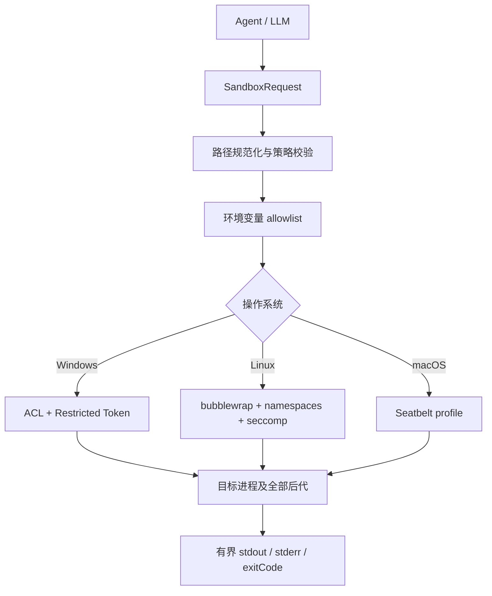

# Agent Sandbox Java SDK

本项目为 Java Agent 提供统一的进程沙箱 API，并在 Windows、Linux 和 macOS 上使用各自的操作系统安全机制执行模型生成的命令。

核心原则只有一句：

> 不判断命令字符串是否“安全”，而是让操作系统在文件、网络和进程访问发生时强制执行策略。

因此，无论目标命令最终调用的是 Bash、CMD、PowerShell、Python、Node、Git，还是自定义 EXE，都必须处在同一条操作系统安全边界内。

## 平台总览

| 平台 | 文件系统边界 | 网络边界 | 进程树边界 | 严格读取白名单 |
|---|---|---|---|---|
| Windows | 当前普通用户、NTFS ACL、Capability SID、`WRITE_RESTRICTED` Token | 默认不限制；可选专用账户 Firewall 后端 | Job Object | 否；当前实现只支持 `ReadPolicy.HOST` |
| Linux / WSL2 | bubblewrap mount namespace、只读/可写 bind mount | seccomp socket policy | PID namespace、bubblewrap PID 1、`--die-with-parent` | 是 |
| macOS | Seatbelt / SBPL deny-default profile | Seatbelt network rules | Seatbelt 继承、Java 监督与超时回收 | 是 |

!!! warning "同一个策略，不等于同一种内核机制"
    Java API、路径策略、环境过滤和输出协议可以跨平台复用；Windows Access Token、Linux namespace 和 macOS Seatbelt 不能互相移植。SDK 使用 Strategy 模式把统一策略翻译成不同平台的原生规则。

## 请求如何执行



## 最小 SDK 示例

```java
Path workspace = Path.of("/srv/agent/workspace");

SandboxRequest request = SandboxRequest.builder(workspace, "/bin/sh")
        .arguments("-c", modelGeneratedCommand)
        .protect(workspace.resolve(".git"))
        .readPolicy(ReadPolicy.DECLARED_ONLY)
        .network(NetworkPolicy.DENY)
        .timeout(Duration.ofMinutes(2))
        .build();

SandboxResult result = SandboxClient.create().execute(request);
```

Windows Builder 自动使用 `ReadPolicy.HOST + NetworkPolicy.ALLOW`，默认不需要 setup、账户或 Firewall 配置。完整 API 用法见 [SDK 集成](SDK.md)，权限字段的准确语义见 [策略模型](policy-model.md)。

## 阅读路线

1. [总体架构](architecture.md)：理解信任边界、执行链和设计模式。
2. [实现原理与权限控制粒度](implementation-and-permission-granularity.md)：从代码路径理解三端实现与当前真实能力。
3. [策略模型](policy-model.md)：理解每一个 `SandboxRequest` 字段。
4. 选择对应平台：[Windows](platforms/windows.md)、[Linux](platforms/linux.md) 或 [macOS](platforms/macos.md)。
5. 上线前阅读 [安全边界与威胁模型](security-boundaries.md)。
6. 遇到缩写或系统名词时查 [术语表](glossary.md)。

## 非目标

本 SDK 不是：

- Shell 命令黑名单；
- 恶意代码检测器；
- 反病毒软件；
- 内核漏洞防护；
- Windows 上的严格文件保密容器；
- 硬件虚拟化边界。

面对主动攻击型 native binary、恶意依赖、跨租户任务或高价值秘密时，应使用一次性 VM，并只映射允许交换的数据目录。
