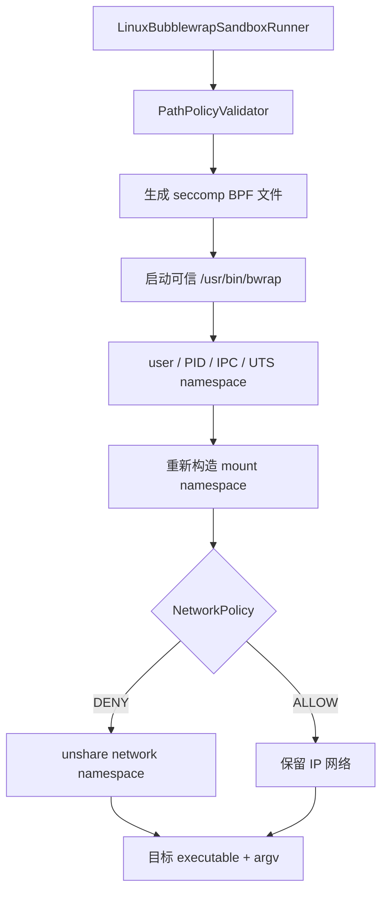

# Linux 与 WSL2 实现

Linux 后端使用 bubblewrap 构造文件系统和进程 namespace，并给 bubblewrap 传入 seccomp classic-BPF 过滤器。它不靠文件本身的宿主权限模拟沙箱，而是让目标进程看到一个重新组装的 mount namespace。

## 执行链



## bubblewrap

bubblewrap（命令名 `bwrap`）是一个非特权 sandbox 构造工具。它负责创建 namespace、bind mount、最小 `/proc` 和 `/dev`，然后在新环境中 `exec` 目标程序。

SDK 默认只接受：

```text
/usr/bin/bwrap
/bin/bwrap
```

也可通过 `SANDBOX_BWRAP` 配置其他绝对路径。生产镜像应固定并校验二进制来源，不能让不可信请求控制这个环境变量。

## Namespace 名词

namespace 是 Linux 内核提供的资源视图隔离。它们彼此独立，不存在一个单独叫“namespace sandbox”的总开关。

### User namespace

隔离用户和组 ID 映射。bubblewrap 可以让沙箱内部身份拥有构造 namespace 所需的局部能力，同时不获得宿主同等权限。

本项目传递 `--unshare-user` 并随后 drop 全部 capability。

### Mount namespace

让沙箱拥有独立挂载表。宿主路径是否可见、只读还是可写，由 bind mount 组合决定。

### PID namespace

给沙箱提供独立进程编号视图。bubblewrap 成为其中的 PID 1，负责转发信号和回收孤儿进程。

### IPC namespace

隔离 System V IPC 和 POSIX message queue 等 IPC 资源，减少目标进程与宿主进程通过共享 IPC 对象交互。

### UTS namespace

隔离 hostname/domainname 视图，避免直接共享这些 UTS 属性。

### Network namespace

提供独立网络设备、路由和 socket namespace。`NetworkPolicy.DENY` 时使用 `--unshare-net`，目标进程看不到宿主网络接口。

## 文件系统视图

### `ReadPolicy.DECLARED_ONLY`

bubblewrap 从空视图开始，只绑定最小运行时与声明路径：

```text
empty root
  + /usr /bin /lib ...       RO
  + readable roots           RO
  + private temp             RW
  + writable roots           RW
  + protected paths          RO override
  + /proc
  + /dev
```

概念命令：

```bash
bwrap \
  --ro-bind /usr /usr \
  --ro-bind /project /project \
  --bind /project/generated /project/generated \
  --ro-bind /project/.git /project/.git \
  --proc /proc \
  --dev /dev \
  --chdir /project \
  -- executable args...
```

### `ReadPolicy.HOST`

先执行只读根绑定：

```text
--ro-bind / /
```

随后 writable root 的 RW bind mount 覆盖对应子树，protected path 再覆盖回 RO。因此宿主广泛可读，但默认不可写。

### Bind mount

把已有目录或文件映射到新 mount namespace 的某个路径。本项目使用两类：

- `--ro-bind source destination`：只读视图；
- `--bind source destination`：读写视图。

它们不复制数据。沙箱写 writable bind 时就是在修改对应宿主目录。

## `/proc`、`/dev` 与 `/tmp`

- `--proc /proc`：创建适合新 PID namespace 的 procfs；
- `--dev /dev`：创建受控设备视图，而不是直接暴露整个宿主 `/dev`；
- `--dir /tmp`：在严格模式中先创建 `/tmp`，再绑定每次执行的私有 temp。

SDK 不把宿主 `/tmp` 整体作为共享可写目录。

## Capability drop

Linux capability 把传统 root 权限拆成多个能力位。`--cap-drop ALL` 要求 bubblewrap 在目标环境中删除全部 capability，减少 mount、网络管理等特权攻击面。

Capability drop 不等于 seccomp，也不等于文件系统 namespace；三者分别限制 privilege、系统调用行为和路径视图。

## seccomp classic-BPF

seccomp 让内核在系统调用入口执行 BPF 过滤器。当前过滤器不是完整 syscall allowlist；它专门阻止宿主 Unix-domain socket 访问。

### 为什么文件只读仍不够

Docker socket、D-Bus socket、SSH agent socket 是文件系统路径，但“连接 socket”可能触发高权限服务行为。即使 socket 节点本身只读，连接它仍可能跨越沙箱边界。

### 当前规则

过滤器：

1. 校验 seccomp audit architecture；
2. architecture 不匹配时 kill process；
3. 检查 `socket` 和 `socketpair` syscall；
4. 第一个参数为 `AF_UNIX` 时返回 `EPERM`；
5. 其他 syscall 放行。

支持：

| 架构 | audit arch | socket syscall | socketpair syscall |
|---|---:|---:|---:|
| x86_64 | `AUDIT_ARCH_X86_64` | 41 | 53 |
| aarch64 | `AUDIT_ARCH_AARCH64` | 198 | 199 |

因此即使选择 `NetworkPolicy.ALLOW`，常规 TCP/UDP IP 网络可用，但 AF_UNIX 仍被拒绝。这是刻意的安全差异。

### `no_new_privs`

Linux 要求非特权进程在安装 seccomp filter 前设置 `no_new_privs`。该标志保证后续 `execve` 不会通过 setuid/setgid 或 file capability 获得新 privilege，并且 seccomp filter 会跨 exec 保留。SDK 不直接调用 `prctl`；这部分由受信任的 bubblewrap 执行路径负责。

## 进程树

- `--unshare-pid` 创建 PID namespace；
- bubblewrap PID 1 回收后代；
- `--die-with-parent` 让 launcher 消失时 sandbox 一起退出；
- `--new-session` 创建新的终端 session，降低与宿主终端进程组耦合；
- Java `ProcessExecutor` 仍负责 timeout、输出和最终回收。

## 网络策略

### DENY

`--unshare-net` 创建新的 network namespace。没有宿主物理接口和路由；namespace 内 loopback 语义仍属于内核本地行为。同时 seccomp 阻止 AF_UNIX。

### ALLOW

不创建 network namespace，因此保留宿主 IP 网络视图；seccomp 仍阻止 AF_UNIX。宿主 Firewall、代理和服务认证照常生效。

## WSL2

WSL2 使用真实 Linux 内核，可走相同 bubblewrap 路径，但必须确认：

- 发行版安装了 bubblewrap；
- 内核和发行版允许 unprivileged user namespace；
- 不把 `/mnt/c` 等宿主盘作为无差别 readable/writable root；
- 不暴露 Docker socket 或 Windows interop 逃逸面。

WSL1 不具备相同内核隔离能力，不应假设此后端可以工作。

## 限制

- 与宿主共享内核，不能防御 kernel exploit；
- 受限容器环境可能禁止 user namespace；
- 当前 seccomp 不是通用 syscall allowlist；
- 当前 SDK 不直接配置 cgroup CPU/内存配额；
- writable root 中已有 hard link 仍可能指向同文件系统其他 inode；
- 可信外部进程可以在验证与 bwrap 启动之间替换祖先目录，工作区父目录必须由服务账户控制；
- `SANDBOX_BWRAP` 只能由可信部署配置控制。

## 一手资料

- [bubblewrap README](https://github.com/containers/bubblewrap)
- [Linux namespaces](https://man7.org/linux/man-pages/man7/namespaces.7.html)
- [seccomp filter](https://docs.kernel.org/userspace-api/seccomp_filter.html)
- [no_new_privs](https://docs.kernel.org/userspace-api/no_new_privs.html)
- [User namespaces](https://man7.org/linux/man-pages/man7/user_namespaces.7.html)
- [Codex permissions enforcement](https://learn.chatgpt.com/docs/permissions#how-enforcement-works)
