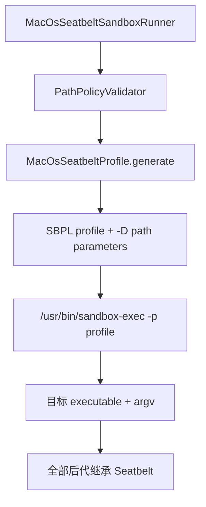

# macOS 实现

macOS 后端使用系统 `/usr/bin/sandbox-exec` 把动态生成的 Seatbelt Sandbox Profile Language（SBPL）策略应用到目标进程。目标进程的后代继承同一 Seatbelt policy。

## 执行链



## Seatbelt

Seatbelt 是 macOS 的内核沙箱机制。它根据进程携带的 profile 判断文件、网络、Mach service、sysctl、I/O Kit 等操作。

它与 App Sandbox 有关联但不是同一个产品概念：

- App Sandbox 通常由应用 entitlement 和系统容器模型管理；
- 本项目通过 `sandbox-exec` 为命令行子进程应用 SBPL profile。

## `sandbox-exec`

`sandbox-exec` 是系统提供的命令行 launcher，接收 profile 后 `exec` 目标命令。本项目要求固定绝对路径：

```text
/usr/bin/sandbox-exec
```

Apple 已将该接口标记为 deprecated，意味着未来兼容性需要持续验证；deprecated 不代表当前所有系统立即不可用。

如果宿主 Java 进程本身位于不允许嵌套的 App Sandbox 中，`sandbox_apply: Operation not permitted` 会被转换成 `SandboxBackendUnavailableException`，不会无沙箱运行。

## SBPL

Sandbox Profile Language 是 Lisp 风格策略语言。当前 profile 从：

```scheme
(version 1)
(deny default)
```

开始，然后只加入运行命令所需的 allow rule。

### `deny default`

未明确允许的操作默认拒绝，是 allowlist 沙箱的基础。它与“先全部允许，再列少量 deny”相反。

### `file-read*`

允许匹配路径范围内的文件读取、元数据读取和遍历。`DECLARED_ONLY` 下只开放最小系统运行时与 policy readable roots。

### `file-write*`

允许匹配 writable roots 的写操作。私有 temp 也是内部 writable root，因此项目根可以保持只读。

### protected path deny

对于 `.git` 等 protected paths，profile 增加：

```scheme
(deny file-write* (subpath (param "PROTECTED_0")))
```

即使其父目录可写，显式 deny 仍阻止该子树写入。

### `subpath` 与 `literal`

- `subpath`：匹配目录及全部后代；
- `literal`：只匹配单一完整路径。

例如 `/dev/null` 使用 literal，workspace 使用 subpath。

## 为什么路径使用 `-D` 参数

调用方路径可能包含空格、引号、反斜杠或 SBPL 特殊字符。直接把路径字符串拼进 profile 会产生策略注入或转义错误。

本项目 profile 中使用：

```scheme
(subpath (param "WRITABLE_0"))
```

启动时再传：

```text
-DWRITABLE_0=/Users/example/project
```

路径作为参数值传递，而不是作为 SBPL 代码插入。

## 最小运行时授权

`DECLARED_ONLY` 不会只开放 workspace，因为动态链接器、Shell 和系统库仍需要读取 macOS 运行时。当前包含：

```text
/System
/usr
/bin
/sbin
/private/etc/passwd
/private/etc/group
/private/etc/hosts
/private/etc/resolv.conf
/private/etc/ssl
/private/var/db/timezone
/dev
```

这是一组兼容性基线，不表示系统目录可写。

## 进程与 IPC 规则

### `process-exec`

允许执行新的程序。没有它，Shell 不能启动 Git、Java、Python 等工具。

### `process-fork`

允许创建子进程。Seatbelt policy 会由后代继承。

### `signal (target same-sandbox)`

只允许向同一 sandbox 中的进程发送信号，避免任意控制宿主进程。

### `process-info* (target same-sandbox)`

允许获取同一沙箱进程的信息，满足常见运行时和进程管理需要。

### Mach lookup

macOS 大量系统服务通过 Mach port 名称发现。deny-default 会让很多基础运行时失败，因此当前只开放最小已知服务，例如目录服务和电源管理控制服务。

Mach lookup allowlist 是兼容性面，也是需要随系统版本回归测试的攻击面；不能无差别使用 `(allow mach-lookup)`。

### sysctl allowlist

Java、编译器和系统库可能读取 CPU、内存、OS 版本等 sysctl。当前只允许一组明确名称或前缀，不开放 blanket sysctl。

### IOKit

当前允许打开 `RootDomainUserClient`，用于有限系统能力发现。IOKit 暴露内核驱动接口，规则必须保持最小化。

### pseudo-TTY

profile 包含受限 pty 与 `/dev/ptmx` 访问，兼容需要终端语义的工具。SDK 对外仍只支持一次性 stdin，不承诺完整交互式 TTY API。

## 网络策略

### DENY

profile 不添加 network allow rule。由于 `deny default`，目标命令的网络操作被 Seatbelt 拒绝。

### ALLOW

profile加入：

```scheme
(allow network-outbound)
(allow network-inbound)
(allow system-socket)
```

这表示 Seatbelt 不再阻止这些操作，宿主 Firewall、路由和应用认证仍然生效。

## `ReadPolicy` 映射

### DECLARED_ONLY

仅允许最小运行时、readable roots 和 writable roots 读取。适合不希望命令看到整个用户目录的任务。

### HOST

加入 `(allow file-read*)`，宿主文件广泛可读，但 file write 仍只开放 writable roots。

## 进程树和回收

Seatbelt policy 由 fork/exec 后代继承，因此子进程不能通过简单启动另一个 executable 摆脱文件和网络策略。

但 macOS 没有当前实现可直接等价于 Windows Job Object 或 Linux PID namespace 的强进程容器。本项目由 Java `ProcessExecutor`：

- 等待根进程；
- timeout 时销毁根进程及可观察后代；
- 正常结束后回收观察到的后台后代。

恶意程序若利用竞态快速 daemonize，进程生命周期回收强度弱于 Windows/Linux。对“绝不允许遗留进程”的高风险场景使用 VM。

## 限制

- `sandbox-exec` 已 deprecated；每个目标 macOS 版本都必须实测；
- App Sandbox 宿主可能禁止嵌套 Seatbelt；
- 与宿主共享内核，不能防御 kernel exploit；
- 没有内建 CPU/内存/disk quota；
- 最小 Mach/sysctl/IOKit allowlist 可能随工具链改变；
- 外部可信进程仍可能制造验证到启动之间的目录替换竞态；
- hard link 与工作区供应链风险需要额外处理。

## 一手资料

- 本机可通过 `man sandbox-exec` 查看系统随附接口说明；
- [Apple App Sandbox](https://developer.apple.com/documentation/security/app-sandbox)
- [Codex permissions enforcement](https://learn.chatgpt.com/docs/permissions#how-enforcement-works)
- [Codex Seatbelt base policy](https://github.com/openai/codex/blob/main/codex-rs/core/src/seatbelt_base_policy.sbpl)
