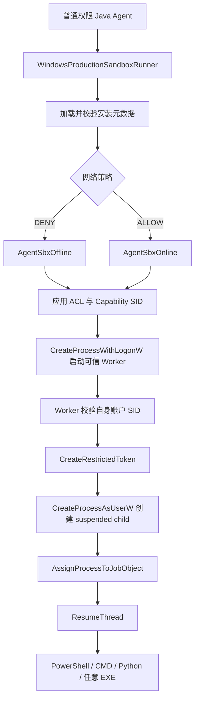
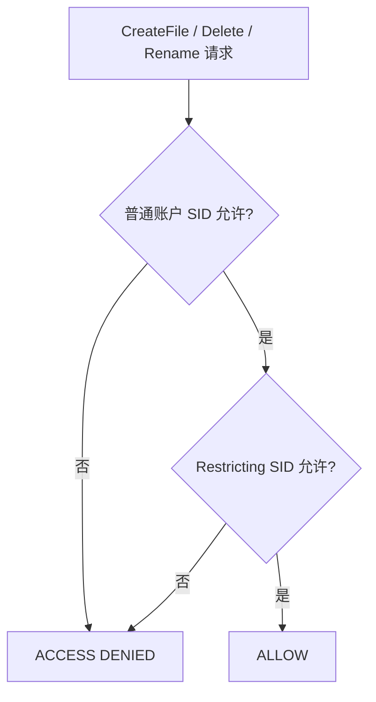

# Windows 实现

Windows 是三个平台中生命周期最复杂的后端。当前生产路径不是 AppContainer，也不调用 Codex 二进制，而是由本项目的 Java/JNA 代码组合以下机制：

```text
专用本地账户
+ NTFS ACL
+ 随机 Capability SID
+ WRITE_RESTRICTED Token
+ Private Desktop
+ Windows Firewall
+ Job Object
```

## 总体执行链



## Setup 与 Run 分离

### Setup 阶段

`setup-windows` 必须从管理员终端执行。它负责：

1. 创建 `AgentSbxOffline` 和 `AgentSbxOnline` 两个普通本地用户；
2. 生成强随机密码；
3. 使用当前真实用户的 DPAPI 加密密码并保存安装元数据；
4. 安装、校验可信 worker runtime；
5. 给 sandbox 用户授予 Java runtime 的读取/执行权限；
6. 给 offline 用户安装 Windows Firewall 入站和出站阻断规则；
7. 隐藏登录界面中的沙箱账户；
8. 收紧安装目录 ACL。

### Run 阶段

日常 Agent 保持普通权限。每次执行只做短期 capability 配置、启动 worker、等待结果和回收资源。

!!! warning
    不要以管理员身份运行模型命令。管理员 setup 的作用是建立低权限执行环境，不是让整个 Agent 常驻高权限。

## Windows 安全名词

### SID

Security Identifier，Windows 用来标识用户、组、登录会话或合成安全主体的稳定二进制标识。账户名可以改变，访问检查使用 SID。

本项目涉及三类 SID：

- 真实 Java Agent 用户 SID；
- `AgentSbxOffline` / `AgentSbxOnline` 的账户 SID；
- 每次运行随机生成的 synthetic capability SID。

### Access Token

每个 Windows 进程都有主访问令牌，描述用户 SID、组 SID、登录 SID、完整性级别和 privilege。内核访问文件、注册表、进程等 securable object 时，会把 token 与对象 security descriptor 比较。

### Restricted Token

由 `CreateRestrictedToken` 从已有 token 派生的更低权限 token。它可以：

- 禁用 SID；
- 删除 privilege；
- 加入 restricting SID 列表。

本项目使用：

```text
DISABLE_MAX_PRIVILEGE | LUA_TOKEN | WRITE_RESTRICTED
```

### `DISABLE_MAX_PRIVILEGE`

关闭新 token 中除基础遍历权限外的大部分 privilege，减少命令通过系统级 privilege 绕过普通 ACL 的能力。

### `LUA_TOKEN`

生成 Limited User Account 风格的 token，使其采用受限用户语义，而不是继承高权限上下文。

### `WRITE_RESTRICTED`

让 restricting SID 只参与写访问检查。这是当前 Windows 后端“广泛读取、限制写入”的核心。

Windows 会对写访问执行两次判断：



只有两个检查都允许，请求才能成功。

### Capability SID

不对应真实登录用户的随机 synthetic SID。它被同时放到：

1. 当前 writable root 的 Allow Modify ACE；
2. 当前 restricted token 的 restricting SID 列表。

这形成一种短期“写能力票据”。旧 workspace 的 capability SID 不会被新请求复用，因此旧 ACL 即使异常残留也没有活跃 token 可以使用。

### ACL、DACL 与 ACE

- ACL：Access Control List，访问控制列表的统称；
- DACL：Discretionary ACL，决定谁被允许或拒绝哪些访问；
- ACE：Access Control Entry，DACL 中的一条 Allow/Deny 记录。

短期 capability ACE 通过 `GetNamedSecurityInfoW`、`SetEntriesInAclW` 和 `SetNamedSecurityInfoW` 直接修改 DACL。这样随机 synthetic SID 不需要映射成 LSA 账户；`icacls.exe` 在部分 Windows/CI 主机上会对这种 SID 返回 `ERROR_NONE_MAPPED (1332)`。setup 阶段针对真实账户 SID 的固定 ACL 仍可使用 `icacls.exe`。

典型规则：

| 对象 | SID | ACE |
|---|---|---|
| readable root | sandbox 用户 SID | `(OI)(CI)(RX)` |
| writable root | sandbox 用户 SID | `(OI)(CI)(M)` |
| writable root | 随机 capability SID | `(OI)(CI)(M)` |
| protected path | capability SID | `(OI)(CI)(W,D)` Deny |

其中：

- `OI`：Object Inherit，文件继承；
- `CI`：Container Inherit，子目录继承；
- `RX`：Read + Execute；
- `M`：Modify，包含常规读写和删除；
- `W,D`：写和删除相关权限。

短期 capability ACE 在命令结束后撤销。DACL 的读取、合并、写回由跨进程 named mutex 串行化，避免并发执行相互覆盖 ACE。专用用户的根 ACL 会记录到账本，在 uninstall 时清理。

## 为什么项目根可以只读、子目录可写

策略：

```text
D:\project                    RX
D:\project\src\test\java     M
```

普通 sandbox 用户可能由于继承或宿主 ACL 对项目有更宽权限，但 restricted token 的 restricting SID 只在 `src\test\java` 拥有 Modify ACE。因此：

- 写 `D:\project\README.md`：第二次检查失败；
- 写 `D:\project\src\test\java\DemoTest.java`：两个检查都成功。

示例策略：

```java
SandboxRequest request = SandboxRequest.builder(project, powershell)
        .arguments("-NoProfile", "-NonInteractive", "-Command", command)
        .readOnlyWorkingDirectory()
        .readableRoot(Path.of(System.getenv("USERPROFILE"), "AppData"))
        .writableRoot(project.resolve("src/test/java"))
        .readPolicy(ReadPolicy.HOST)
        .network(NetworkPolicy.ALLOW)
        .build();
```

## Worker 两阶段启动

### `CreateProcessWithLogonW`

Java Agent 使用专用账户的用户名和 DPAPI 解密后的密码启动可信 worker。此时 worker 已经处于专用本地用户身份。

### Worker 身份校验

worker 启动后读取自己的 token SID，并与请求中期望 SID 比较。身份不匹配时失败关闭，防止用错误账户执行内部协议。

### `CreateProcessAsUserW`

worker 从自身 token 创建 restricted token，然后用 `CreateProcessAsUserW` 启动真正目标程序。

目标进程先以 `CREATE_SUSPENDED` 创建，完成 Job Object 绑定后才 `ResumeThread`，避免它在进入进程树边界前抢跑。

## Private Desktop

Windows desktop 是 Win32 窗口和消息的隔离对象，不是显示器桌面壁纸的概念。低权限程序若与高权限程序共享默认 desktop，可能尝试通过窗口消息交互。

本项目为每次目标执行调用 `CreateDesktopW` 创建随机 private desktop，并在 `STARTUPINFO.lpDesktop` 指定它。Microsoft 的 restricted-token 文档也建议受限应用不要与不受限应用共享默认 desktop。

Private Desktop 解决 UI/message 隔离，不解决文件权限、网络或 CPU 限制。

## Job Object

Job Object 是 Windows 管理一组相关进程的内核对象。子进程通常继续属于同一 Job，适合控制整个命令树。

本项目有两层：

1. worker Job：`JOB_OBJECT_LIMIT_KILL_ON_JOB_CLOSE`；
2. target Job：kill-on-close、最大活动进程数、聚合 Job 内存限制。

默认 target 限制：

```text
最大活动进程数：64
Job 内存上限：2048 MiB
```

timeout 或正常命令结束后都会终止 target Job，避免 `Start-Process background.exe` 留下后台进程。

## Handle allowlist

创建目标进程时只允许 stdin、stdout、stderr 三类明确句柄继承。`PROC_THREAD_ATTRIBUTE_HANDLE_LIST` 避免 Java/worker 中其他敏感句柄意外泄漏给不可信命令。

## Path Lease 与 reparse point

### Reparse point

Windows 的文件系统重解析机制，junction、symbolic link 和某些云文件都可能使用。路径字符串看似位于 workspace，实际可被重定向到别处。

当前后端：

- 逐级检查路径组件是否带 `FILE_ATTRIBUTE_REPARSE_POINT`；
- 拒绝 UNC 网络路径；
- 要求策略路径与 executable 位于 NTFS；
- 打开重要路径并不授予 delete sharing，在执行期间降低路径被删除替换的 TOCTOU 风险；
- executable 句柄进一步不授予 write sharing。

这不能自动解决 writable root 内预先存在的 hard link 风险，上传或解压工作区仍需单独清洗链接。

## 网络账户与 Firewall

### Offline account

`AgentSbxOffline` 绑定持久 Windows Defender Firewall 入站/出站 Block 规则。每次 DENY 执行前会验证：

- 所有 Firewall profile 已启用；
- 两条规则在 ActiveStore 中存在；
- action、direction 与 LocalUser SID 正确。

### Online account

`AgentSbxOnline` 不绑定 SDK 的阻断规则。`NetworkPolicy.ALLOW` 选择该账户。

ALLOW 的含义是“SDK 不阻断”，不是绕过宿主 Firewall、代理、企业 GPO 或服务认证。

## Session 与内部协议

每次运行使用受保护 session 目录和有界二进制请求/结果文件。协议包含 magic、版本和长度上限，避免 worker 把任意文件当作可信请求反序列化。

内部协议不是 SDK 公共 API；升级 SDK 后必须重新执行 setup，使 worker runtime 与主 SDK 版本一致。

## Windows 读取限制

`WRITE_RESTRICTED` 的 restricting SID 只在写访问时参与判断。普通 `Users`、`Authenticated Users` ACE 仍可能让 sandbox 用户读取其他宿主文件。

因此当前 Windows 后端：

- 只接受显式 `ReadPolicy.HOST`；
- readable root 表示“确保专用账户能读取”，不表示“除此之外都不能读”；
- 适合防误写、防破坏和网络限制；
- 不应被描述为严格数据保密边界。

严格只读白名单需要 Hyper-V/独立 VM，只映射允许目录。

## 失败模式与运维

以下情况会拒绝执行：

- setup 未安装或 worker 版本不匹配；
- 账户 SID 与安装元数据不一致；
- DENY 请求的 Firewall 规则无效；
- 路径包含 reparse point、UNC 或非 NTFS；
- 请求 `DECLARED_ONLY`；
- ACL、token、desktop、Job 或 process 创建失败；
- worker 未生成合法结果。

升级、安装和卸载详见 [SDK 集成](../SDK.md)。

## 一手资料

- [CreateRestrictedToken](https://learn.microsoft.com/windows/win32/api/securitybaseapi/nf-securitybaseapi-createrestrictedtoken)
- [Restricted Tokens](https://learn.microsoft.com/windows/win32/secauthz/restricted-tokens)
- [Job Objects](https://learn.microsoft.com/windows/win32/procthread/job-objects)
- [CreateProcessAsUserW](https://learn.microsoft.com/windows/win32/api/processthreadsapi/nf-processthreadsapi-createprocessasuserw)
- [CreateProcessWithLogonW](https://learn.microsoft.com/windows/win32/api/winbase/nf-winbase-createprocesswithlogonw)
- [Desktop Security and Access Rights](https://learn.microsoft.com/windows/win32/winstation/desktop-security-and-access-rights)
- [How DACLs Control Access](https://learn.microsoft.com/windows/win32/secauthz/how-dacls-control-access-to-an-object)
- [Codex Windows sandbox](https://learn.chatgpt.com/docs/windows/windows-sandbox)
